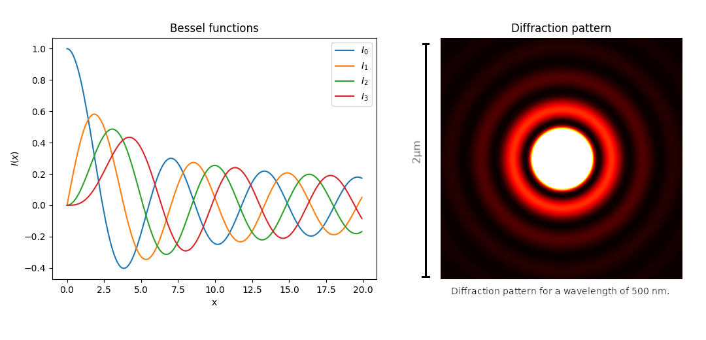

# Diffraction Limit

Calculating the diffraction limit of a telescope of unit radius for a particular wavelength.

# Implementation

[Bessels functions](https://en.wikipedia.org/wiki/Bessel_function) are calculated numerically using Simpson's rule. The intensity is calculated at each point and then plotted.

# Demo



# Dependancies

Numpy for manipulating image matrices and matplotlib for plotting
```
pip install numpy
pip install matplotlib
```
