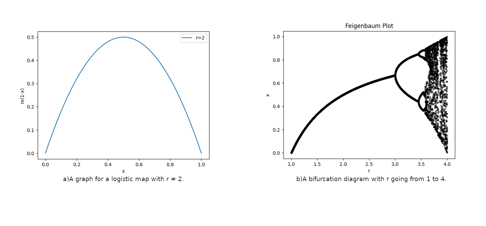

# Feigenbaum Diagram

A program to plot a [Bifurcation diagram](https://en.wikipedia.org/wiki/Bifurcation_diagram)

# Implementation

Takes the logistic map "x' = rx(1-x)" and plots the r vs x values for r across a range of values. A thousand
iterations given first for the values to settle down and then another 1000 values are taken and plotted.

# Demo



# Dependancies

Numpy for matrix manipulation and Matplotlib for plotting the graphs.
```
pip install numpy
pip install matplotlib
```