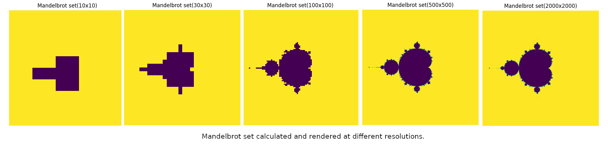
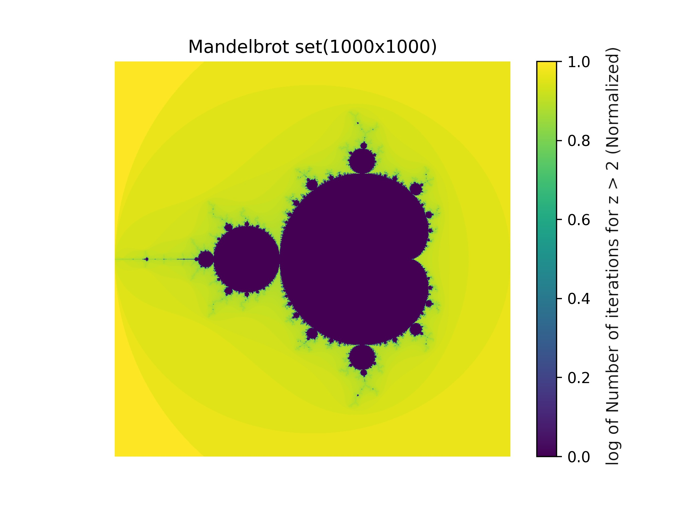

# Mandelbrot set

Code for plotting a [Mandelbrot set](https://en.wikipedia.org/wiki/Mandelbrot_set)

# Demo

Mandelbrot set being rendered at progressively higher resolutions


Mandelbrot set visualized


# Implementation

At each point c in the complex plane it is checked if the recursive function z' = z^2 + c exceeds 2 in 100 iterations.
If yes the point is taken as a part of the mandelbrot set if not it is not. For more representative visualization the 
points are color coded according to how long it takes for them to exceed two. Hence color coded according to the normalized
log of the number of iterations it takes to cross the value of 2.

# Dependancies

Numpy for matrix multiplication and Matplotlib for plotting
```
pip install numpy
pip install matplotlib
```