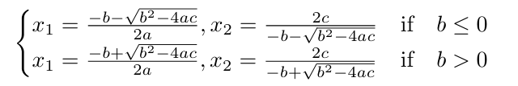

# Quadratic equation solutions

A simple program that finds the solutions to a quadratic

## Implementation

Due to the limitations of precision of floating point numbers in computations, subtractions involving numbers of the same sign and of similar 
magnitudes can lead to large errors in the calculation. So such calculations are preferably avoided for computing solutions.

### Normal quadratic formula

The normal quadratic formula is given by

This has the problem that it has to have a special case for a. Also for one of the roots it will involve subtracting wo numbers of the same sign (which root will depend on sign of b)

### Alternative formula

Multiplying the quadratic formula with the conjugate of its denominator we can arrive at an alternate formula

Here we have solved the special case problem. But the subtraction still persists. But for the other root.

### Stable formula

Now using a hybrid of both the previous formulae we can arrive at a formula that avoids the same problematic subtraction altogether



## Example

for a quadratic *0.001x^2 + 1000x + 0.001* using the first formula we calculate the roots as
```
roots :-9.999894245993346e-07, -999999.999999
error : -1.057540066535716e-11,-1.00000761449337e-06
```
using the second formula 
```
roots :-1.000000000001e-06, -1000010.5755125057
error : 1.0001341524705151e-18,10.575512505718507
```
we can see that the error in one of the roots is higher than the alternate formula for both cases. Now using the hybrid formula
```
roots :-1.000000000001e-06, -999999.999999
error : 1.0001341524705151e-18,-1.00000761449337e-06
```
we get the smaller errors in both cases.