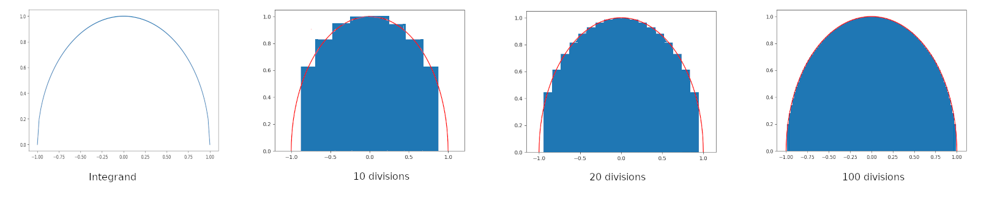

# Riemann Integral

A simple program that calculates the integral of a function x^2 + y^2 = 1 using riemann integration

## Demo

We can see that with increasing number of divisions we get better and better approximations of the integral.

as this is a semicircle we already know the value of the integral to be pi/2. We compare the values obtained from the integration to this value. We can see that the error keeps going down as we keep increasing the number of iterations

| Number of iterations | Value              | Error                   | %Error        |
|----------------------|--------------------|-------------------------|---------------|
| 10                   | 1.3586543247679108 | -0.21214200202698574    |   15.61412628 |
| 100                  | 1.5534179294048955 | -0.01737839739000102    |    1.11872002 |
| 1000                 | 1.5691729158636207 | -0.00015874279544458858 | 0.01011633542 |
| 10000                | 1.570637583999452  | -0.00015874279544458858 | 0.01010690162 |
| 100000               | 1.570780566239904  | -1.576055499263873e-05  |      1.00E-03 |
